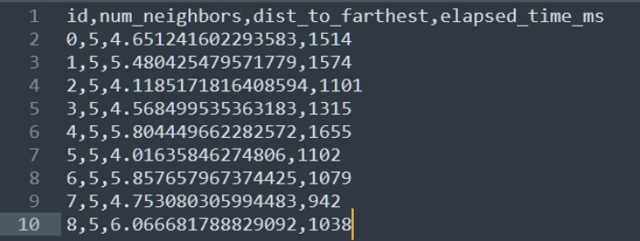

## Basic Description

1. Make sure you have Java¹ installed
2. Open the config.sh file and configure your execution, or use the configuration already present
3. Run the application by executing the "run.sh" script
4. Check the result file inside the MAIN_FOLDER.

## Understanding the outputs

The result file is written as a _.csv_ file, with it's first row representing column names. The following is an illustration of the result file. 

 

The columns are organized as follows:

| Column Name | Description |
| ------ | ------ |
| id | A sequential identifier for each query object. |
| num_neighbors | The number of objects returned by the query. |
| dist_to_farthest | The distance between the query object and the farthest neighbor in the result set. |
| elapsed_time_ms | A measurement of query elapsed time in milliseconds. |

## Running _diversity browsing_

1. Open the config.sh file
2. Make sure the EXAMPLE variable is set to "1" (_diversity browsing_)
3. Set a value for _k_ in the K_VALUE variable
4. Set BUILD_TREE to "TRUE" if you haven't built an index
5. Select a PIVOT_ALGO if you're using the VP-Tree index
6. Pick a DISTANCE_FUNCTION
7. Check the result file inside the MAIN_FOLDER.

## Running a sequential scan BRID

1. Open the config.sh file
2. Make sure the EXAMPLE variable is set to "2" (BRID)
3. Set a value for _k_ in the K_VALUE variable
4. Pick a DISTANCE_FUNCTION
5. Check the result file inside the MAIN_FOLDER

¹Code was tested with Java 1.8.0_301
